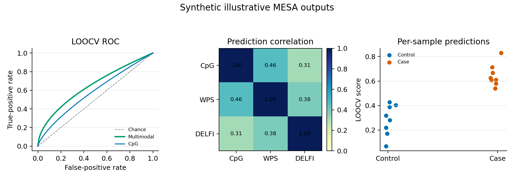

Multi-modal Modeling
====================================

MESA Modeling
-------------

CFTK includes MESA-style multimodal modeling commands.

Install the analysis dependencies, including ``mesa-cfdna``, before using
these commands:

.. code-block:: bash

   python -m pip install ".[analysis]"

Run modality performance screening:

.. code-block:: bash

   cftk --config cftk_init.json mesa --performance

Run model construction:

.. code-block:: bash

   cftk --config cftk_init.json mesa --mesa-model

Run leave-one-out cross-validation and plots:

.. code-block:: bash

   cftk --config cftk_init.json mesa --loocv

Commonly used together:

.. code-block:: bash

   cftk --config cftk_init.json mesa --performance --mesa-model --loocv

Expected Outputs
----------------

MESA writes a compact set of tables, a serialized model, and LOOCV figures:

.. code-block:: text

   results/5_mesa/
   |-- label.tsv
   |-- modality_performance.tsv
   |-- MESA_model.pkl
   |-- loocv_predictions.tsv
   |-- mesa_roc.png / mesa_roc.pdf
   |-- mesa_heatmap.png / mesa_heatmap.pdf
   `-- mesa_spearman.png / mesa_spearman.pdf

The synthetic visual below mirrors those three plot families and the
prediction table. It is intentionally illustrative: it is not an observed
ALS model, does not estimate performance for a cohort, and does not replace
inspection of ``loocv_predictions.tsv`` and the model settings.

   Fixed-seed synthetic MESA output types for documentation orientation only.
