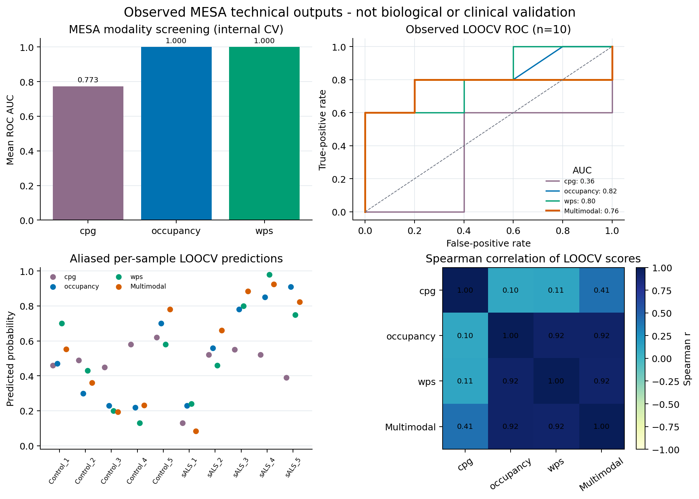

Multi-modal Modeling
====================================

MESA Modeling
-------------

CFTK includes MESA-style multimodal modeling commands.

Install the analysis dependencies, including ``mesa-cfdna``, before using
these commands:

.. code-block:: bash

   python -m pip install ".[analysis]"

Run modality performance screening:

.. code-block:: bash

   cftk --config cftk_init.json mesa --performance

Run model construction:

.. code-block:: bash

   cftk --config cftk_init.json mesa --mesa-model

Run leave-one-out cross-validation and plots:

.. code-block:: bash

   cftk --config cftk_init.json mesa --loocv

Commonly used together:

.. code-block:: bash

   cftk --config cftk_init.json mesa --performance --mesa-model --loocv

Expected Outputs
----------------

MESA writes a compact set of tables, a serialized model, and LOOCV figures:

.. code-block:: text

   results/5_mesa/
   |-- label.tsv
   |-- modality_performance.tsv
   |-- MESA_model.pkl
   |-- loocv_predictions.tsv
   |-- mesa_roc.png / mesa_roc.pdf
   |-- mesa_heatmap.png / mesa_heatmap.pdf
   `-- mesa_spearman.png / mesa_spearman.pdf

The observed visual below combines those plot families with the prediction
table for five controls and five sALS samples. It is a technical workflow
example only. In particular, perfect-looking internal screening values can
occur in a ten-sample run and do not estimate performance for a cohort or a
clinical assay. Inspect ``loocv_predictions.tsv``, the model settings, and the
provenance manifest before interpreting any result.

   Observed MESA output from **five controls and five sALS samples**. The
   internal screening bars and LOOCV curves are descriptive artifacts from this
   ten-sample technical run, not biological or clinical validation and not a
   recommended acceptance threshold. Download the sanitized aggregate
   metadata:
   :download:`JSON <../_static/validation_10sample_downstream_summary.json>`.
