Beginner Workflow
=================

``cftk run`` is the recommended first workflow for a schema-v2 project. From
the project directory, initialization and execution require no workflow
parameters:

.. code-block:: bash

   cftk init
   cftk run

The command runs synchronously in the current shell. It performs its own
read-only doctor preflight, stops at the first failed stage boundary, validates
every required artifact, and returns nonzero when the run is incomplete. A
``WARN`` from doctor remains visible but does not block execution; a ``FAIL``
does.

Projects must have a compact schema-v2 ``cftk_init.json``, its matching
``cftk.lock.json``, homogeneous FASTQ or homogeneous BAM inputs, and the
validated Trim Galore, bwa-meth, Sambamba, and MethylDackel toolchain. Use the
individual expert commands for legacy JSON, mixed input types, or alternative
tools.

Default Stages
--------------

The default stage order is deliberate. Fragment-length QC runs before the QC
summary so ``qc_summary.tsv`` can include its median fragment-length metrics.

.. list-table:: Stage contract
   :header-rows: 1
   :widths: 13 22 65

   * - Stage
     - Purpose
     - Required evidence before the next stage
   * - ``process.1``
     - Trim and inspect FASTQs
     - Trimmed R1/R2 FASTQs; per-mate Trim Galore reports and FastQC HTML/ZIP;
       trimming MultiQC HTML.
   * - ``process.2``
     - Align bisulfite reads
     - Per-sample BAM and BAI; ``flagstat`` and ``stats`` tables; alignment
       MultiQC HTML.
   * - ``process.3``
     - Mark duplicates and measure target performance
     - Per-sample marked BAM, BAI, and Sambamba metrics; content-keyed Picard
       interval list; hybrid-selection and per-target coverage tables;
       alignment, insert-size, and GC-bias metrics; Picard completion marker;
       insert-size, GC-bias, and read-length PDFs.
   * - ``process.4``
     - Call merged CpG methylation
     - Per-sample M-bias table, parsed OT/OB bounds, CpG bedGraph, OT/OB SVGs;
       merged ``cpg_matrix.tsv``.
   * - ``qc.2``
     - Measure fragment lengths
     - Per-sample raw fragment-length CSV and histogram PNG; combined
       fragment-length PNG and PDF.
   * - ``qc.0``
     - Assemble QC metrics
     - ``qc_summary.tsv`` and ``qc_scores.tsv``.
   * - ``qc.1``
     - Inspect methylation distribution
     - Methylation-distribution PNG and PDF.

Full-Depth 10-Sample Technical Validation
-----------------------------------------

The figures below come from a completed full-depth run of **10 preselected
technical samples: 5 controls and 5 sALS samples**. Before computation, CFTK
selected the minimum, first quartile, median, third quartile, and maximum paired
compressed FASTQ sizes within each group. This deterministic size-spanning
selection was **not random** and was not based on workflow results.

This subset tests execution, checkpoint recovery, artifact contracts, and
expected output appearance across varied input sizes. It is not a cohort-wide
biological analysis, evidence that the selected samples represent either
population, or a source of clinical or scientific acceptance thresholds. No
sample was filtered from the displayed results.

The final validation summary reported:

.. code-block:: text

   samples:                         10 (5 control, 5 sALS)
   validated stage records:        70 (7 per sample)
   required artifacts:             410
   missing required artifacts:     0
   combined CpG matrix:             5,970,802 rows x 10 samples
   zero-command resume checks:     10 of 10 passed

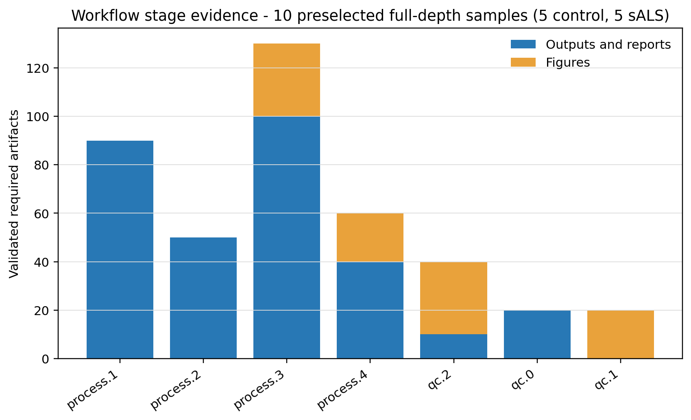

   This is the output contract for all seven default stages. Bars total the
   required output/report and figure files across all ten isolated projects;
   every counted artifact was present when aggregation completed.

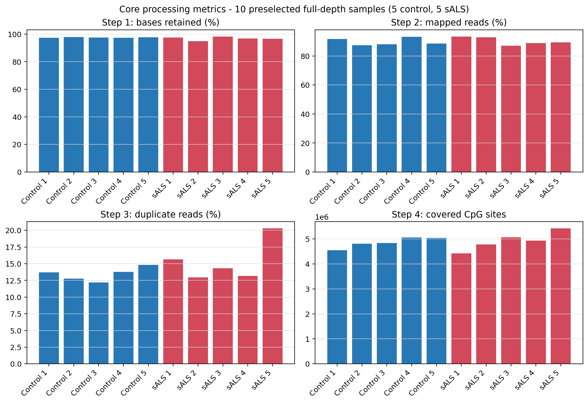

   ``process.1`` through ``process.4`` are represented directly by retained
   bases, mapped reads, duplicate reads, and covered CpG sites. These panels
   show expected per-sample outputs, not pass/fail cutoffs or group tests.

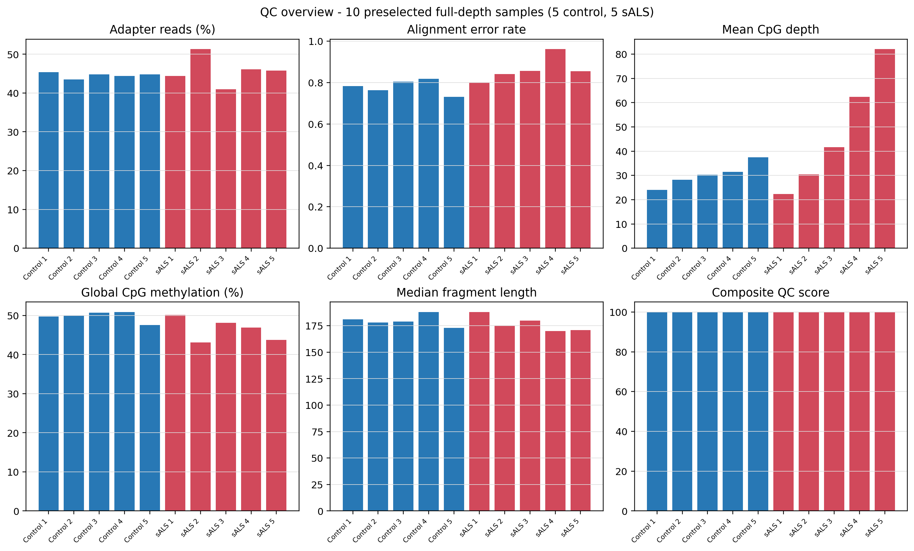

   ``qc.0`` combines selected trimming, alignment, methylation, and fragment
   metrics. Median fragment length is populated for all ten samples. The
   composite score uses the configured default weights and is not a release,
   biological, or clinical acceptance decision.

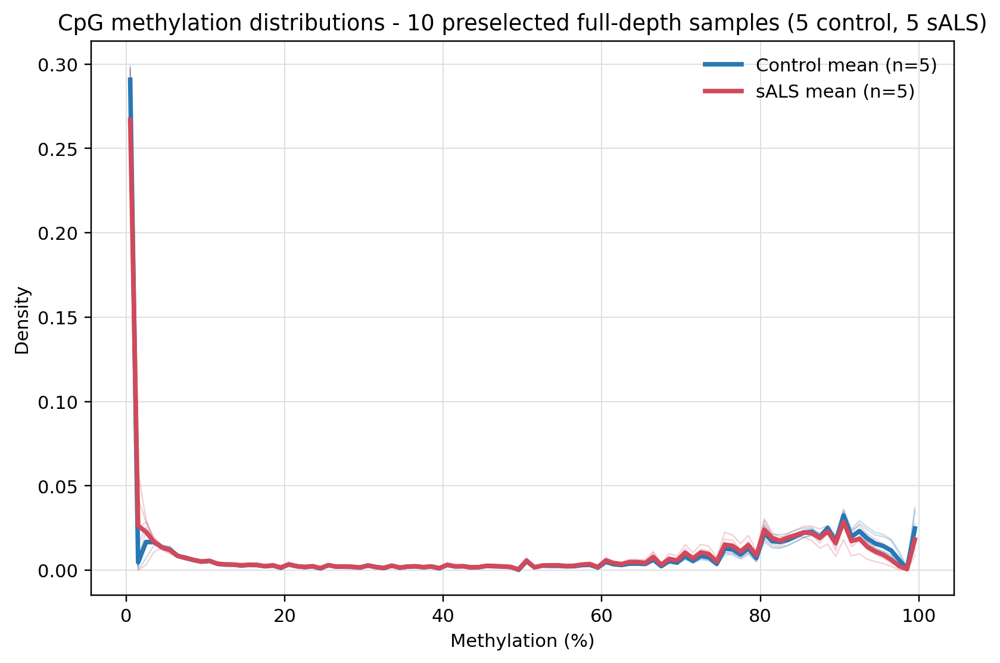

   ``process.4`` produced the CpG values and ``qc.1`` rendered their
   distributions. Thin lines are individual technical samples and thick lines
   are group means for visualization only; no differential test is shown.

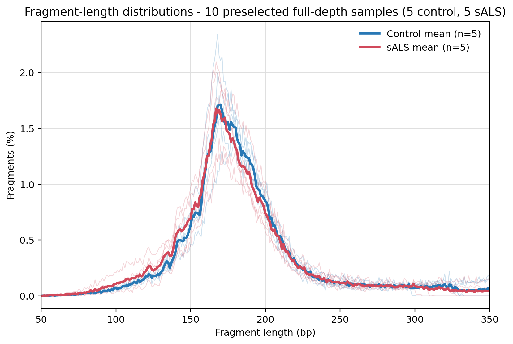

   ``qc.2`` produced one fragment-length table and plot per sample plus the
   combined view. Thin lines are samples and thick lines are descriptive group
   means. Interpret the nucleosomal profile with library preparation and the
   other QC evidence.

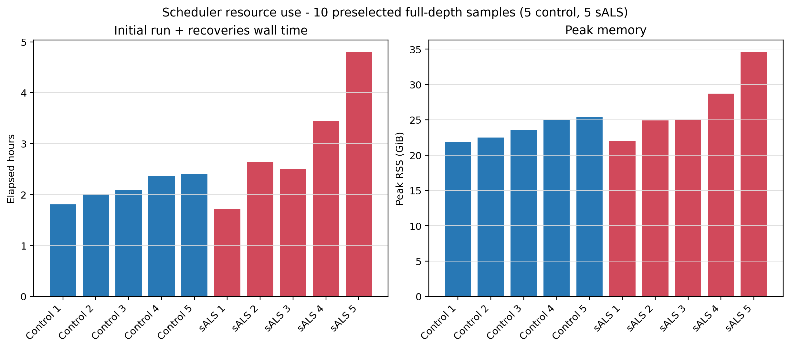

   The resource history includes the initial execution and two checkpoint
   recoveries used while validating package fixes. It demonstrates isolated
   per-sample parallel execution and observed memory use; cumulative elapsed
   time is not a clean-run benchmark or a resource guarantee for another
   cluster.

Detailed Two-Sample Output Examples
-----------------------------------

The following are sanitized renders from **only two preselected example
samples**: one control and one sALS sample from the deterministic Phase 13
smoke test. They were not selected by a recorded random-sampling procedure and
must not be interpreted as representative cohort distributions, biological
group differences, or acceptance thresholds. They show only what a beginner
can expect the workflow outputs to look like; the actual run directory contains
the full-resolution reports, tables, and per-sample files listed in the stage
contract above.

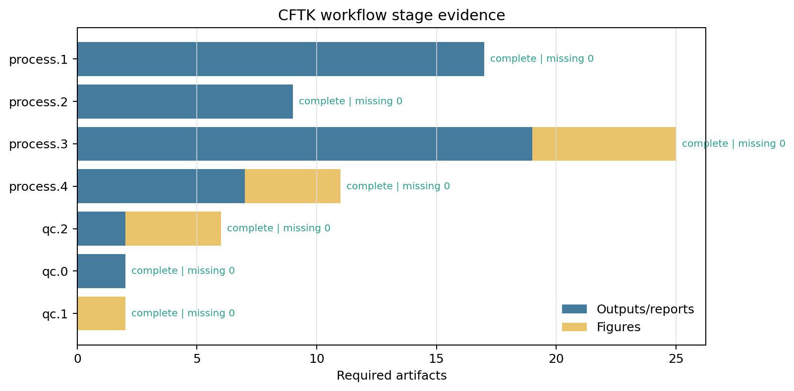

   For these two example samples, the stage-evidence view confirms that every
   stage has the expected output and figure inventory. ``missing 0`` means the
   required artifact contract was satisfied for this technical run only.

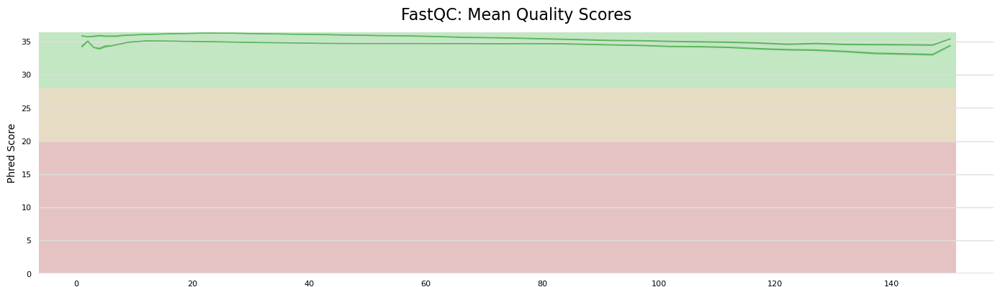

   ``process.1`` produces FastQC and MultiQC quality plots in addition to the
   trimmed FASTQs and text reports.

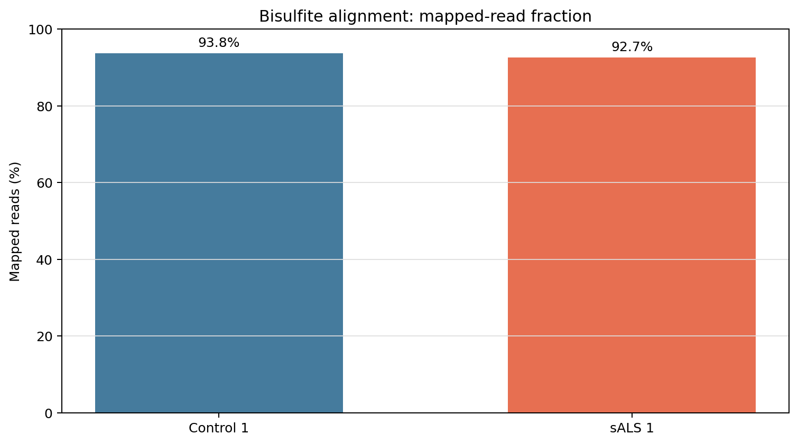

   ``process.2`` produces BAM/BAI files and alignment tables; the MultiQC
   report supplies plots such as mapped-read fraction.

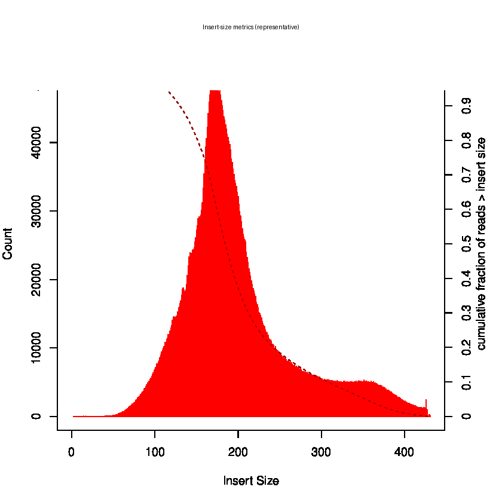

   ``process.3`` produces duplicate-marked BAMs, Sambamba/Picard metrics, and
   Picard insert-size, GC-bias, and read-length figures.

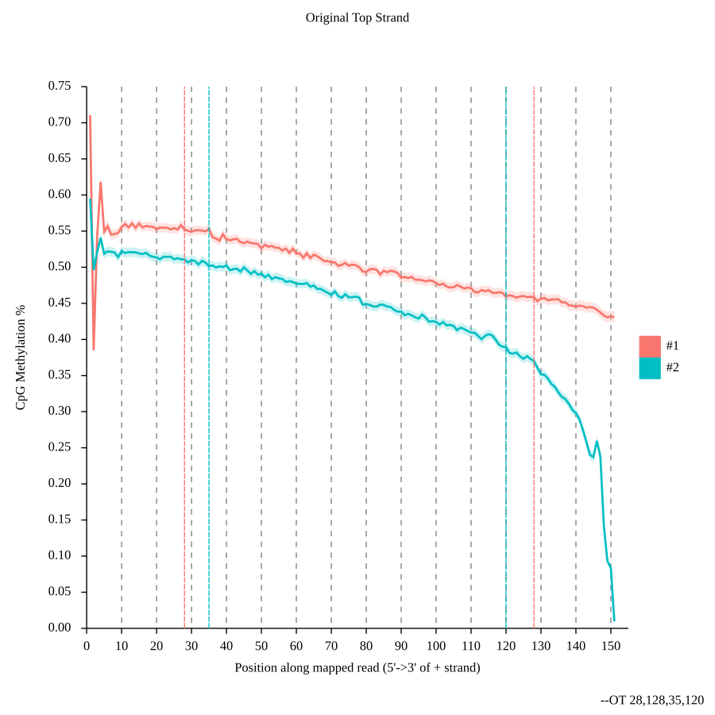

   ``process.4`` produces M-bias tables, parsed OT/OB bounds, CpG bedGraphs,
   and strand-specific M-bias plots before creating the merged matrix.

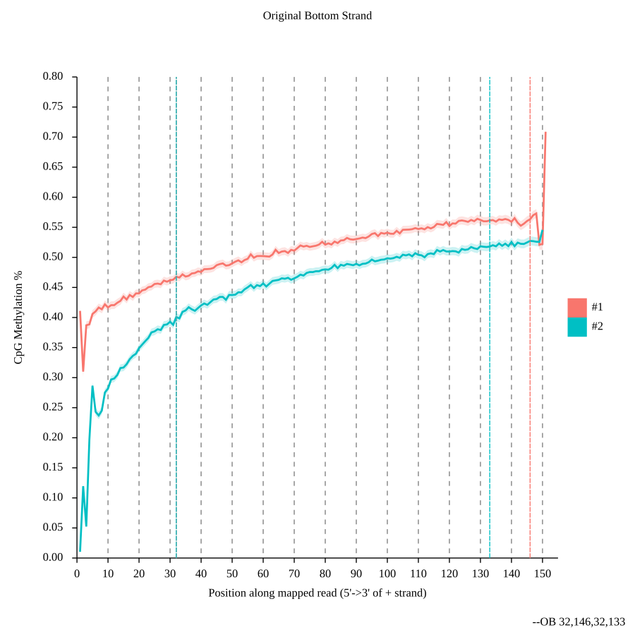

   The OB plot is inspected together with the OT plot; neither plot alone is a
   conversion or sample-quality decision.

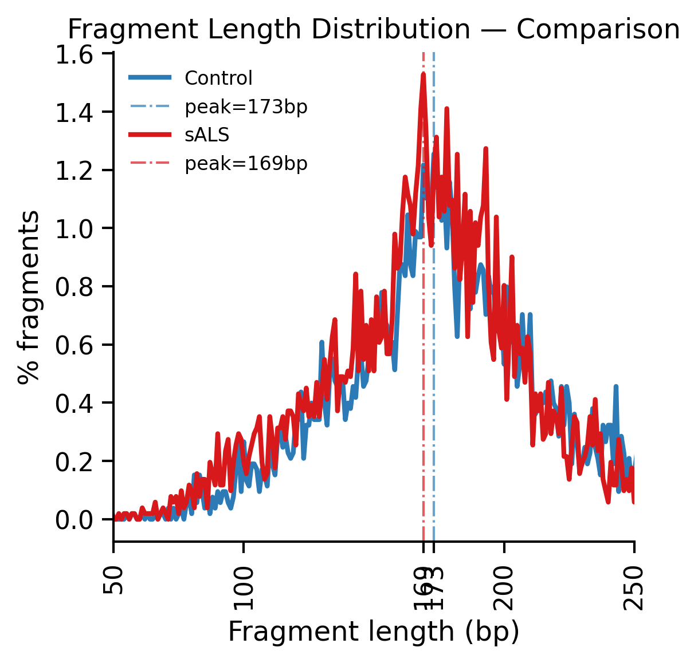

   ``qc.2`` produces raw fragment-length tables and per-sample/combined
   fragment-length figures. These two curves represent individual examples,
   not control/sALS group distributions. The mononucleosomal pattern is
   descriptive and must be interpreted with the other QC outputs.

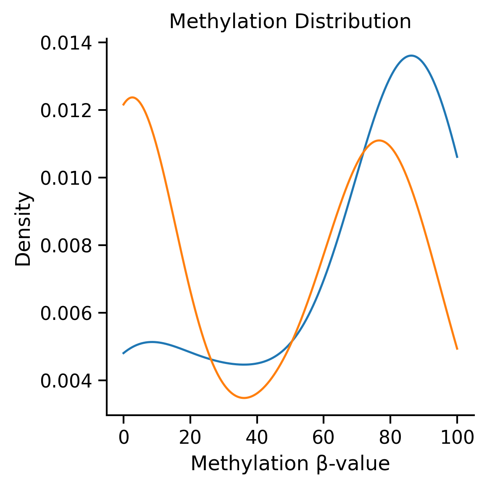

   ``qc.1`` produces the methylation-distribution PNG and PDF. ``qc.0`` is
   intentionally table-only: its ``qc_summary.tsv`` and ``qc_scores.tsv`` are
   the machine-readable outputs consumed by downstream checks.

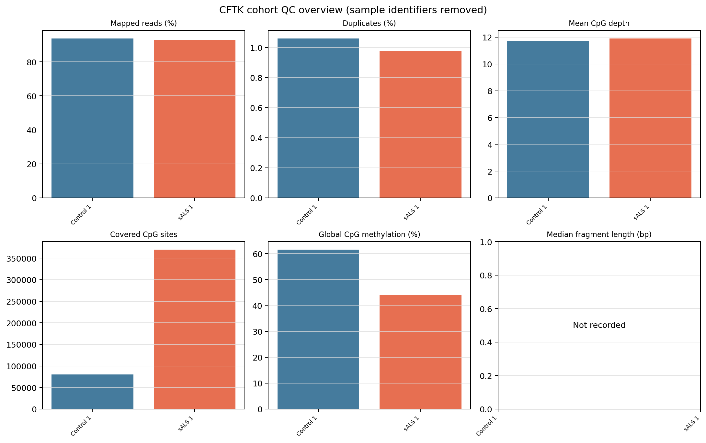

   The run-level QC overview contains one sample per group and is a screening
   figure generated from ``qc_summary.tsv``. It does not estimate group
   behavior or replace inspection of the underlying tables, M-bias plots,
   conversion controls, or assay-specific thresholds.

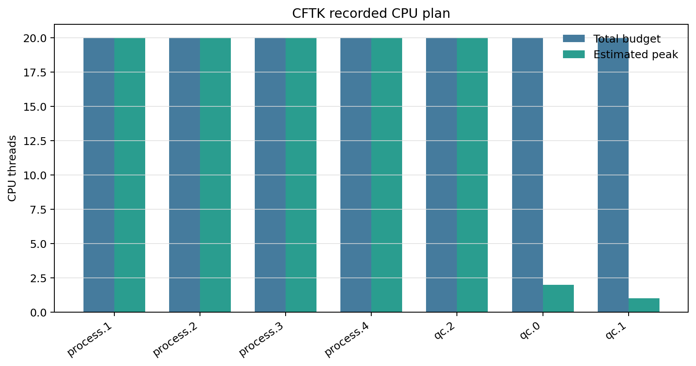

   A dry-run also renders the resolved CPU budget and estimated peak threads.
   This is a planning figure, not a performance benchmark; the scheduler
   allocation and ``resource-plan.json`` remain authoritative.

For a BAM project, ``process.1`` and ``process.2`` are recorded as ``skipped``;
the run starts at duplicate marking. CFTK rejects a project that mixes FASTQ
and BAM rows because such samples do not share the same stage graph.

Add the computationally expensive dinucleotide stage explicitly:

.. code-block:: bash

   cftk run --qc-dinucleotide

This adds ``qc.3`` and requires its combined PNG and PDF. It is not part of the
default because it creates fragment-level intermediate data and invokes
BEDTools across the BAM cohort.

Plan Before Computing
---------------------

Use a dry-run to create the exact stage and artifact plan without probing tools
or processing source data:

.. code-block:: bash

   cftk run --dry-run

The dry-run returns success after writing a ``planned`` attempt. Lower-level
commands whose parameters depend on runtime output, such as MethylDackel OT/OB
bounds derived from M-bias, appear exactly in the runtime command ledger rather
than being guessed in advance.

Failure, Resume, And Existing Outputs
-------------------------------------

Each new invocation creates a distinct attempt. Automatic resume occurs only
when config, lock, run options, prior stage status, and all current artifacts
match a recorded CFTK run. File existence alone is never adopted silently.

If a trusted stage was interrupted or one of its artifacts was damaged, CFTK
moves its existing stage artifacts into:

.. code-block:: text

   results/provenance/quarantine/<new-run-id>/

The original relative paths are preserved and the stage is rebuilt. Nothing is
deleted. Outputs created before run manifests existed require an explicit
review decision:

.. code-block:: bash

   cftk run --adopt-existing

A complete stage is validated and recorded as ``adopted``. A partial stage is
quarantined before retry. Without this flag, untrusted existing outputs stop the
run with an actionable error.

Run Records
-----------

Every attempt is stored under:

.. code-block:: text

   results/provenance/runs/<run-id>/

.. list-table:: Attempt records
   :header-rows: 1
   :widths: 30 70

   * - File
     - Contents
   * - ``run.json``
     - Machine-readable stage states, commands, config/lock/options hashes,
       expected artifacts, recorded outputs, errors, and timestamps.
   * - ``events.jsonl``
     - Append-only run and stage transition events.
   * - ``doctor-before.json``
     - Exact preflight report used to permit or block execution.
   * - ``tool-versions.json``
     - Required executable paths and version probe results.
   * - ``commands.jsonl``
     - Immediate mirror of this attempt's exact external command start/finish
       records. The project-wide copy remains ``provenance/commands.jsonl``.
   * - ``resource-plan.json``
     - Resolved total CPU budget, concurrent samples, per-sample threads,
       estimated peak threads, and detected scheduler allocation.
   * - ``expected-outputs.tsv`` / ``figures.tsv``
     - Auditable stage-to-artifact inventories.
   * - ``run-summary.html``
     - Portable human summary with relative output links and image previews.

``results/provenance/latest-run.json`` points to the newest attempt for
convenience. Prior attempt directories are retained. Archive the project JSON,
sample sheet, lock, run directory, project-wide command ledger, scheduler log,
and software environment together.

Reading The Figures
-------------------

The following plots are fixed-seed synthetic examples generated by
``docs/_static/generate_synthetic_tutorial_figures.py``. They demonstrate
output appearance only: they contain no human-derived data and are not CFTK
validation results.

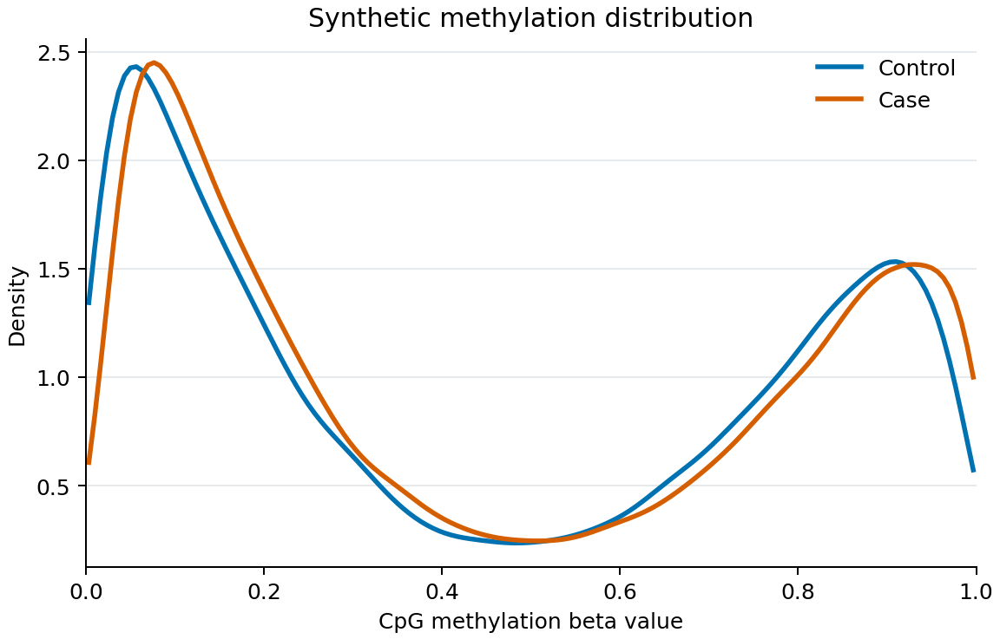

Real methylation profiles should be evaluated alongside coverage, M-bias,
conversion controls, cohort design, and assay expectations. A smooth or
bimodal curve alone does not prove sample quality.

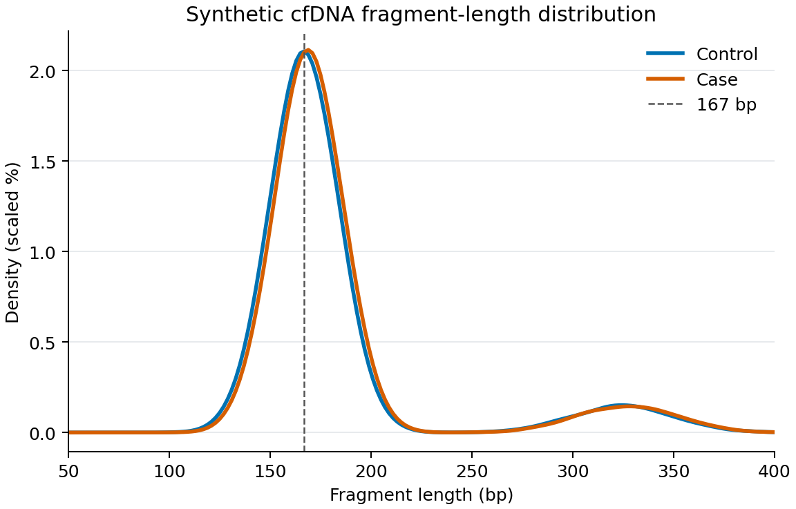

A cfDNA-like mononucleosomal peak can support, but cannot by itself establish,
sample identity or suitability. Investigate library preparation, input type,
size selection, mapping, duplicates, and contamination when distributions are
unexpected.

Stepwise Evidence Bundle
------------------------

For a validation run, create a private evidence bundle after the run finishes.
This is an audit aid for maintainers and beginners following a tutorial; it
does not replace the run contract or change any analysis result. From a source
checkout, point the helper at the recorded manifest:

.. code-block:: bash

   run_json=$(python -c \
       'import json; print(json.load(open("results/provenance/latest-run.json"))["manifest"])')
   python scripts/validation/summarize_workflow_run.py \
       "$run_json" "$(dirname "$run_json")/evidence"

The helper writes private tables and figures beside the attempt. Review the
tables before sharing them because they contain absolute paths and verbatim
commands. The figures are safe to use only after confirming that no sample
identifiers entered a group label or command annotation:

.. list-table:: Evidence files and beginner interpretation
   :header-rows: 1
   :widths: 27 43 30

   * - File
     - What it records
     - What to check
   * - ``workflow_stage_evidence.tsv`` / ``workflow_stage_evidence.png``
     - One row and one bar per process/QC stage, with status, exact stage
       command, required output/report count, required figure count, and
       missing-artifact count.
     - Every required count is present; a ``failed``/``missing`` annotation
       stops interpretation until that stage is repaired.
   * - ``workflow_artifact_inventory.tsv``
     - Every expected BAM, table, report, and figure with required/optional,
       existence, and nonempty checks.
     - Required outputs are nonempty and match the stage contract above.
   * - ``workflow_command_evidence.tsv``
     - A readable copy of each exact external command start/finish record.
       The source of truth remains the append-only ``commands.jsonl`` ledger.
     - Each start has a finish, every finish has return code zero, and the
       command text contains no secrets.
   * - ``workflow_resource_plan.png``
     - Recorded total CPU budget and estimated peak threads for each stage.
     - Peak threads do not exceed the scheduler allocation or configured
       total-core budget.
   * - ``workflow_qc_overview.png``
     - Sanitized bars for mapped reads, duplicates, CpG depth/coverage,
       global methylation, and fragment length when those metrics exist.
     - Treat this as a screening view. Investigate raw tables, M-bias plots,
       conversion controls, and assay expectations before calling a sample
       usable.

The collector reports missing artifacts even for a planned dry-run. A planned
run is useful for checking commands and resource allocation, but it is not
evidence that the external tools completed.

Running On Slurm
----------------

CFTK does not submit scheduler jobs. Put the same synchronous command in a
site-appropriate batch script so the scheduler captures resources and terminal
status. For example:

.. code-block:: bash

   #!/bin/bash
   #SBATCH --cpus-per-task=20
   #SBATCH --mem=48G
   #SBATCH --time=24:00:00
   set -euo pipefail
   source /path/to/conda.sh
   conda activate cftk
   cd /path/to/project
   cftk run --parallel 2

With the default ``process.cores: 20``, this runs at most two sample commands
at a time and gives each multithreaded tool 10 threads. CFTK records that
calculation in ``resource-plan.json`` and displays it in ``run-summary.html``.
If ``SLURM_CPUS_PER_TASK`` is present and smaller than ``process.cores``,
``cftk doctor`` and the run preflight fail before data processing.

Choose memory from the actual data and tool settings. CPU budgeting does not
divide memory automatically. Picard's default maximum is 8 GB per concurrently
processed sample, in addition to BAM processing and Python overhead.

Expert Compatibility Command
----------------------------

``run-all`` remains available for advanced compatibility workflows spanning
downstream analyses. It catches some step failures and continues, has no run
manifest checkpoint contract, and must not be treated as a beginner-safe alias
for ``cftk run``.
