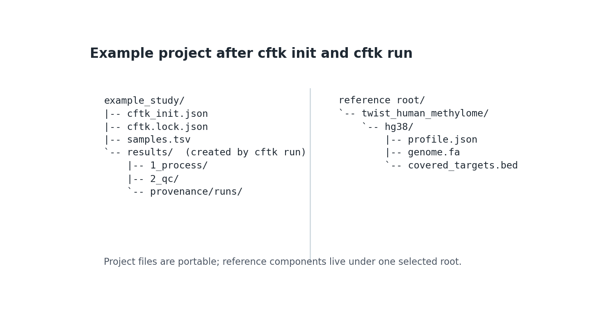

Configuration
=============

CFTK's beginner setup is a guided command run from the project directory:

.. code-block:: bash

   mkdir example_study
   cd example_study
   cftk init

When ``cftk_init.json`` is absent and the terminal is interactive, CFTK asks
for project settings and uses the managed default profile. If ``samples.tsv``
is absent, it
discovers only one unambiguous FASTQ R1/R2 pair or one BAM per sample, writes an
editable template, and stops. Fill in the biological fields and rerun
``cftk init``. CFTK never guesses control and case roles.

Compact Project JSON
--------------------

Schema v2 keeps individual sample and reference-component paths out of the
project JSON; it retains only one overridable reference-root hint:

.. literalinclude:: ../../examples/cftk_init.schema-v2.json
   :language: json
   :caption: examples/cftk_init.schema-v2.json

``assay`` defaults to ``twist_human_methylome`` and ``genome`` defaults to
``hg38``. ``output_dir`` and ``samples`` are resolved relative to the config
file. ``cores``, ``parallel_samples``, and ``min_depth`` must be positive
integers; their defaults are 20, 1, and 10. ``cores`` is the total CPU budget,
not a per-sample value. CFTK divides it across concurrent multithreaded sample
commands. For example, ``cores: 20`` with ``parallel_samples: 2`` gives each
sample up to 10 tool threads. ``parallel_samples`` cannot exceed ``cores``.

Picard commands use an 8 GB maximum Java heap by default. Advanced users can
set ``process.picard_java_memory`` to a positive JVM size such as ``12g`` or
``4096m``.

At runtime CFTK expands schema v2 into the established nested configuration, so
processing and downstream commands keep their existing interfaces. Existing
legacy nested JSON is still accepted without conversion.

Sample Sheet
------------

The TSV header is strict and must contain these columns in any order:

.. code-block:: text

   sample  group  role  input_type  r1  r2  bam

The repository example is:

.. literalinclude:: ../../examples/samples.tsv
   :language: text
   :caption: examples/samples.tsv

``sample``
   Unique output-safe identifier using letters, digits, ``-``, ``_``, or ``.``.

``group`` and ``role``
   Schema v2 supports one or two groups. A one-group project is valid for
   processing and QC and may use role ``control`` or ``case``. No biological
   comparison is inferred for it. A two-group project must have exactly one
   ``control`` group and one ``case`` group; those explicit roles define model
   labels 0 and 1, and group names are not interpreted. Comparative commands
   stop with an actionable error when the project contains only one group.

``input_type``
   Either ``fastq`` or ``bam``. FASTQ rows require both ``r1`` and ``r2``; BAM
   rows require ``bam``. Input paths are resolved relative to ``samples.tsv``
   and must exist during initialization.

Automatic discovery intentionally rejects missing mates, duplicate inputs,
mixed FASTQ/BAM inputs for one sample, and multi-lane FASTQs. Represent those
layouts explicitly after combining lanes upstream.

Noninteractive Setup
--------------------

Batch and HPC setup with the managed default requires only the sample sheet:

.. code-block:: bash

   cftk init --non-interactive \
     --sample-sheet samples.tsv \
     --project-name example_study

The default managed profile and version are selected automatically. Set
``CFTK_REFERENCE_ROOT`` to use a shared cluster cache.

For an offline or institution-managed local profile, select local mode and one
root explicitly:

.. code-block:: bash

   cftk init --non-interactive \
     --sample-sheet samples.tsv \
     --reference-mode local \
     --reference-root /shared/references/cftk

Use ``--profile`` and ``--profile-version`` only for a non-default or
version-ambiguous local root. An expert testing a reviewed private registry may
set ``CFTK_REFERENCE_REGISTRY`` to its JSON path; this does not relax registry
validation or artifact verification.

CFTK refuses to overwrite an existing config or sample sheet. Pass
``--skip-reference-prep`` only for validation when bwa-meth, ``.fai``, and
Picard ``.dict`` companions are managed separately.

Expected Outputs
----------------

After a successful initialization, the project contains the compact settings,
sample metadata, and portable lock identity below. ``results/`` and its
provenance records appear when ``cftk run`` starts; the managed reference
profile remains under the selected reference root rather than being copied
into every project.

.. code-block:: text

   example_study/
   |-- cftk_init.json
   |-- cftk.lock.json
   |-- samples.tsv
   `-- results/                         (after cftk run)
       `-- provenance/runs/<run-id>/

   Static documentation example of the project/reference boundary. It is a
   layout illustration, not a copied patient project or a claim that every
   reference component is created inside the project directory.

Reference Root And Lock
-----------------------

Only the reference root is public. Component paths are derived from the
profile manifest under ``<root>/<profile>/<version>``. Runtime root precedence
is ``CFTK_REFERENCE_ROOT``, then ``reference_root`` in JSON, then
``~/.cache/cftk/references``. This lets the same project move between a laptop
and cluster without rewriting individual paths.

Initialization writes ``cftk.lock.json`` atomically. It records the project
config hash, sample-sheet hash, profile ID/version, manifest hash, every
component hash, and managed registry-entry hash when applicable, but no
reference-root path. Regenerate the lock with
``cftk init`` after an intentional config, sample, or profile change.

Legacy Configuration
--------------------

Legacy configs continue to expose ``comparison``, nested ``samples``,
``reference_data``, ``process``, and ``analysis``. The repository-root
``cftk_init.json`` remains the complete legacy example. New projects should use
schema v2 because it avoids repeating file paths and tool defaults.
