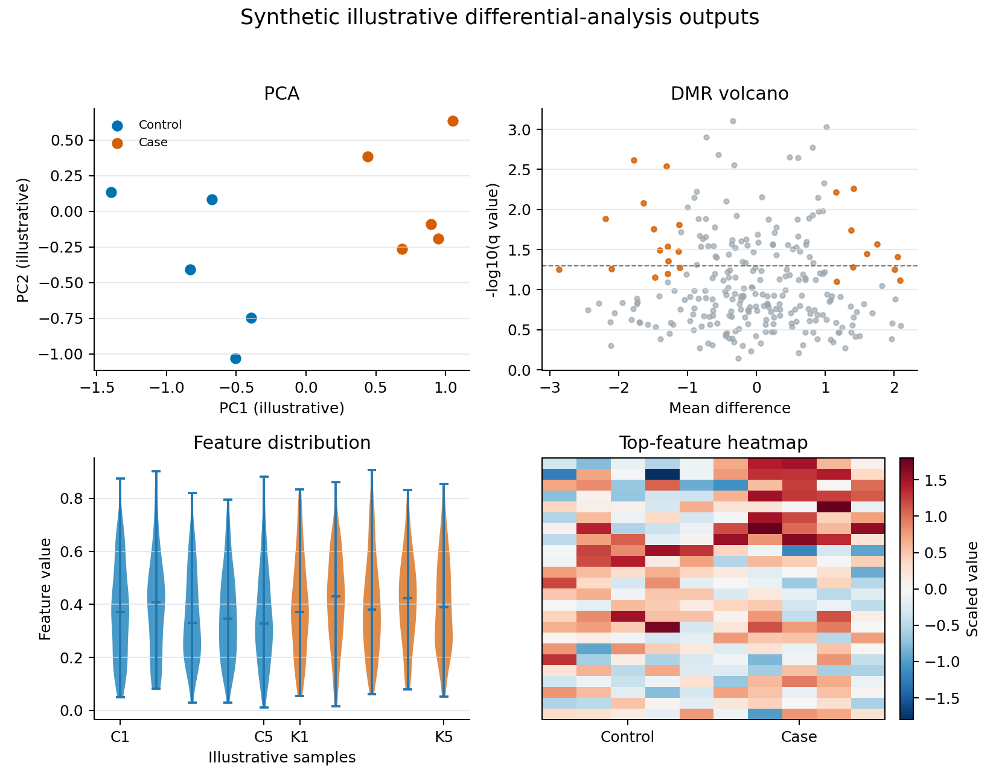

Differential Analysis
=====================

CFTK separates feature-level differential analysis from region-level DMR
analysis.

Install the downstream statistical dependencies before using differential or
DMR commands:

.. code-block:: bash

   python -m pip install ".[analysis]"

Feature-Level Analysis
----------------------

Run PCA, differential testing, and visualization for configured modalities:

.. code-block:: bash

   cftk --config cftk_init.json diff

Run one modality:

.. code-block:: bash

   cftk --config cftk_init.json diff --modality cpg

Default matrix locations are derived from ``output_dir`` and the modality name.
For example, ``cpg`` uses:

.. code-block:: text

   <output_dir>/results/1_process/5_merged_matrix/cpg_matrix.tsv

DMR Analysis
------------

Run DMR preparation, ``metilene``, annotation, and plotting:

.. code-block:: bash

   cftk --config cftk_init.json dmr

DMR sample subsets can be configured in ``analysis.dmr.samples``. BedGraph
files are resolved from:

.. code-block:: text

   <output_dir>/results/1_process/4_methylation/

Expected Outputs
----------------

For each selected modality, CFTK writes the feature-level table and PCA
intermediates under one modality directory:

.. code-block:: text

   results/3_differential/<modality>/
   |-- differential_result.tsv
   |-- pca_coordinates.txt
   |-- pca_variance.txt
   |-- pca.png / pca.pdf
   |-- violin.png / violin.pdf
   `-- heatmap.png / heatmap.pdf

The DMR command adds ``results/3_differential/dmr/metilene_input.bedGraph``,
``dmr_raw.bed``, ``dmr_annotated.bed``, and the regenerated
``dmr_volcano.png``/PDF. Run ``vis --mode diff dmr`` after changing inputs if
the figures need to be regenerated.

   Fixed-seed **synthetic illustrative output** showing the four visual types
   associated with differential analysis. It is not derived from the ALS
   cohort, does not demonstrate a CFTK biological result, and must not be used
   to choose a cutoff or claim group separation. Use the TSV and text files
   above for the actual run.

Regenerate Plots
----------------

.. code-block:: bash

   cftk --config cftk_init.json vis --mode diff dmr
