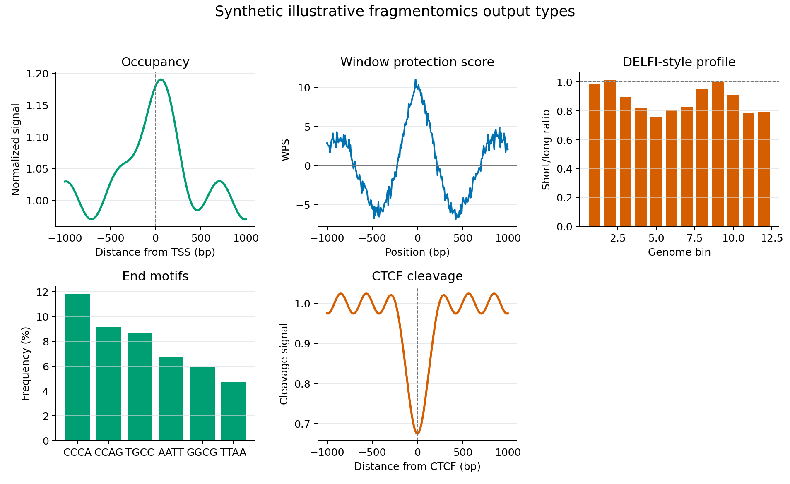

Fragmentomics
=============

The ``frag`` command runs fragmentomics workflows. If no sub-workflow flag is
provided, CFTK attempts all configured fragmentomics analyses.

Install the fragmentomics Python dependencies before using this command:

.. code-block:: bash

   python -m pip install ".[fragmentomics]"

.. code-block:: bash

   cftk --config cftk_init.json frag

Sub-Workflows
-------------

``--occupancy``
   Run DANPOS-style nucleosome occupancy analysis.

``--wps``
   Compute window protection score features.

``--delfi``
   Run DELFI-style fragment ratio features through ``finaletoolkit``.

``--end-motif``
   Run k-mer end motif analysis through ``finaletoolkit``.

``--cleavage``
   Run CTCF cleavage analysis through ``finaletoolkit``.

Examples
--------

Run only WPS:

.. code-block:: bash

   cftk --config cftk_init.json frag --wps

Run occupancy and DELFI:

.. code-block:: bash

   cftk --config cftk_init.json frag --occupancy --delfi

Reference Inputs
----------------

Fragmentomics workflows use different reference files:

- ``chrom_sizes`` for genomic intervals and bigWig/binned workflows.
- ``genome_2bit`` for DELFI and some finaletoolkit commands.
- ``tss_pas_bed`` for WPS and occupancy regions.
- ``ctcf_bed`` for cleavage.
- ``blacklist``, ``gap``, and ``bins`` for DELFI-style features.

Outputs are written under:

.. code-block:: text

   <output_dir>/results/4_fragmentomics/

Expected Outputs
----------------

The sub-workflows have different primary artifacts. A matrix is created for
occupancy and WPS when more than one sample is available; use the merge
command for modalities that return per-sample tables.

.. list-table:: Fragmentomics output contract
   :header-rows: 1
   :widths: 20 42 38

   * - Sub-workflow
     - Primary files
     - Directory
   * - occupancy
     - ``<sample>.occupancy.tsv``, ``<sample>.bw``, and
       ``occupancy_matrix.tsv`` for multi-sample runs
     - ``results/4_fragmentomics/occupancy/``
   * - WPS
     - ``<sample>.wps.tsv`` and ``wps_matrix.tsv`` for multi-sample runs
     - ``results/4_fragmentomics/wps/``
   * - DELFI
     - ``<sample>_delfi.tsv``; merge to ``delfi_matrix.tsv`` when needed
     - ``results/4_fragmentomics/delfi/``
   * - end motif
     - ``<sample>_<kmer>mer.tsv``
     - ``results/4_fragmentomics/end_motif/``
   * - cleavage
     - ``<sample>_cleavage.bw``
     - ``results/4_fragmentomics/cleavage/``

``cftk vis --mode frag`` writes PNG/PDF summaries beside these directories,
including occupancy, DELFI, end-motif, cleavage, and comparison plots when
the corresponding inputs exist. The following fixed-seed figure shows the
five output types together so a beginner can recognize the expected shape of
each result before running a full cohort.

   Fixed-seed **synthetic illustrative output types**. The panels contain no
   human-derived measurements and are not a DELFI score, nucleosome result,
   cleavage finding, or validation figure. The per-sample tables and matrices
   listed above are the authoritative outputs of a real run.
