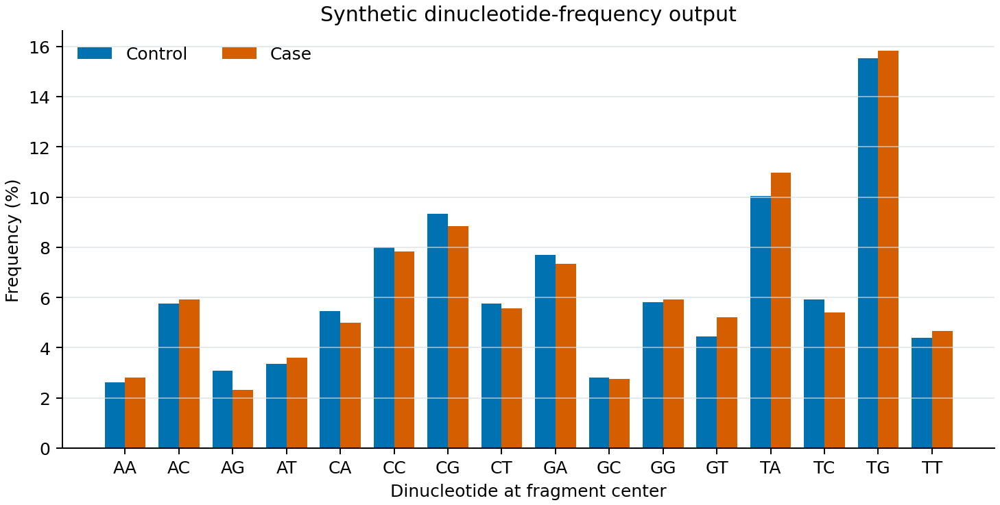

cfDNA Quality Control
=====================

The ``qc`` command has one table-assembly step and three cfDNA feature checks.

0. QC metrics and scores
   Parses process reports into ``qc_summary.tsv`` and ``qc_scores.tsv``. Run
   fragment-length step 2 first when the summary should include median fragment
   length.

1. Methylation distribution
   Uses the merged CpG matrix to plot cohort methylation beta-value densities.
   Interpret this with coverage, M-bias, conversion, and assay information; its
   shape alone is not a sample-quality verdict.

2. Fragment length distribution
   Uses duplicate-marked BAMs and deepTools ``bamPEFragmentSize`` to write raw
   lengths, per-sample histograms, and a combined cohort plot.

3. Dinucleotide frequency
   Requires the reference FASTA and configured fragment settings. This
   expensive stage is opt-in for ``cftk run``.

.. code-block:: bash

   cftk --config cftk_init.json qc -s 2 0 1

The beginner workflow uses that order by default. Add step 3 explicitly when
needed:

.. code-block:: bash

   cftk --config cftk_init.json qc -s 3

Expected Output Location
------------------------

QC outputs are written under:

.. code-block:: text

   <output_dir>/results/2_qc/

Expected Outputs
----------------

.. list-table:: QC output contract
   :header-rows: 1
   :widths: 18 44 38

   * - Step
     - Output location
     - Files to inspect
   * - ``qc.0``
     - ``results/2_qc/``
     - ``qc_summary.tsv`` and ``qc_scores.tsv``
   * - ``qc.1``
     - ``results/2_qc/1_methylation_distribution/``
     - ``methylation_distribution.png`` and ``methylation_distribution.pdf``
   * - ``qc.2``
     - ``results/2_qc/2_fragment_length/``
     - ``fragment_length.<sample>.raw.csv``, per-sample histograms, and the
       combined PNG/PDF
   * - ``qc.3``
     - ``results/2_qc/3_dinucleotide_freq/``
     - per-motif intermediate tables plus ``dinucleotide_freq.png`` and PDF

The first three visuals below are sanitized observed technical outputs from
the documented two-sample example run. The dinucleotide panel is a fixed-seed
synthetic illustration because no public-safe QC-step-3 run artifact is
available. None of these panels defines a user-facing pass/fail threshold.

.. figure:: ../_static/workflow_qc_overview.png
   :alt: Sanitized CFTK QC overview
   :width: 100%

   ``qc.0`` is table-first. This sanitized overview is a rendering of the
   summary metrics and is useful for orientation; the TSV files remain the
   authoritative machine-readable outputs.

.. figure:: ../_static/workflow_methylation_distribution_example.png
   :alt: Sanitized methylation distribution example
   :width: 72%

   ``qc.1`` reads the merged CpG matrix and writes the methylation-distribution
   PNG/PDF. The curve must be interpreted with depth, M-bias, and conversion
   evidence.

.. figure:: ../_static/workflow_fragment_length_example.png
   :alt: Sanitized fragment length example
   :width: 72%

   ``qc.2`` writes raw fragment-length tables and per-sample/combined plots.
   The two curves are examples, not group-level inference.

   Synthetic, fixed-seed illustration of the shape of a ``qc.3`` dinucleotide
   output. It contains no human-derived measurements and is not validation
   evidence.
