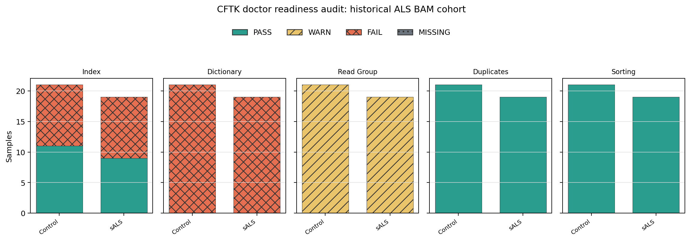
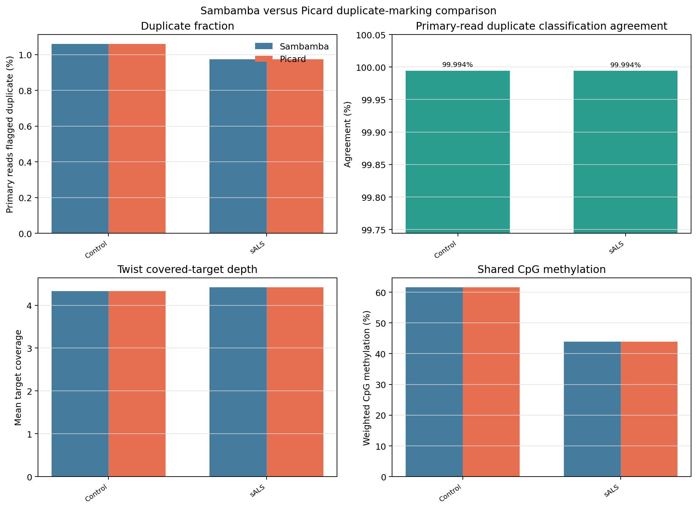

Internal Validation Record
==========================

This maintainer-only record shows how CFTK was checked against a historical ALS
BAM cohort and how the default Sambamba duplicate-marking implementation was
compared with Picard. It is not part of the beginner workflow, does not run
automatically, and does not define a user-facing equivalence gate.

Keep the BAMs, scheduler logs, JSON reports, and command ledgers in a private
validation directory. Do not commit patient-level files or absolute local
paths to the repository.

Step 1: Audit The Cohort
------------------------

Start with a sample sheet that identifies the biological group and points to
the BAM already produced by an upstream workflow. CFTK does not infer whether
an external BAM was aligned or duplicate-marked from its filename alone.

Run the read-only doctor audit for methylation readiness:

.. code-block:: bash

   set +e
   cftk doctor --step 4 --json > doctor.json
   doctor_status=$?
   set -e
   printf 'doctor exit status: %s\n' "$doctor_status"

An exit status of ``1`` means at least one required readiness check failed; it
is not a successful analysis. The JSON report preserves the reason for every
sample. Doctor never downloads, reindexes, rewrites headers, or modifies BAMs.

Convert the report into tables and a cohort-level figure:

.. code-block:: bash

   python scripts/validation/summarize_doctor_audit.py \
       doctor.json samples.tsv validation/audit

The command writes:

* ``cohort_readiness_checks.tsv``: one row per sample and readiness check;
* ``cohort_readiness.tsv``: one compact row per sample for filtering and review;
* ``cohort_readiness_summary.json``: counts, interpreter, platform, and source
  report paths; and
* ``cohort_readiness.png``: the figure below, with separate Control and sALS
  bars and color-independent status hatching.

In the validation example, the cohort contains 21 controls and 19 sALS
samples. All 40 historical BAMs fail the exact managed-reference dictionary
check, 20 also have stale indexes, and all 40 have incomplete read-group
metadata. Sorting and duplicate-marking provenance pass. The correct beginner
action is to stop and resolve the reference/provenance issue, not to hide the
failure by regenerating an index against a different reference.

Step 2: Choose A Technical Comparison Pair
--------------------------------------------

Duplicate-marking parity must start from the same *pre-markdup alignment BAM*.
Comparing a Picard output against an already Sambamba-marked BAM is circular.
The validation pair uses one control and one sALS sample from the preserved
5-million-pair Phase 13 run. Both alignment BAMs are coordinate-sorted and use
the managed Twist/hg38 reference. The full-size historical pre-markdup BAMs
were not available, so this is a technical subset comparison, not a cohort-wide
biological acceptance result.

Record the selection and the M-bias-derived OT/OB bounds in a private manifest:

.. code-block:: text

   sample  group    input_bam  ot_bounds       ob_bounds
   ...     Control  ...        28,128,35,120   32,146,32,133
   ...     sALS     ...        29,138,28,119   33,124,34,132

The bounds are held constant between methods. That isolates duplicate marking
as the changed processing decision while retaining the production
``--mergeContext --minDepth 10 --maxVariantFrac 0.25`` extraction contract.

Step 3: Re-run Both Methods
---------------------------

The validation runner recreates both methods from each common alignment BAM,
then runs the same Twist covered-target Picard metrics and MethylDackel
extraction on each output:

.. code-block:: bash

   bash scripts/validation/run_duplicate_marking_comparison.sh \
       duplicate_manifest.tsv \
       /path/to/hg38_no_alt_analysis_set.fa \
       /path/to/twist_human_methylome_hg38_covered_targets.interval_list \
       validation/duplicate_compare 10

Every expanded shell command is recorded in ``commands.trace``. Each tool
also has a ``/usr/bin/time -v`` resource report. The output directory contains
the two marked BAMs and indexes, Sambamba and Picard metrics, per-target
coverage, two MethylDackel CpG bedGraphs per sample, tool versions, and a
SHA-256 ledger. The runner refuses to overwrite an existing output directory.

Step 4: Compare Read And Assay Outputs
--------------------------------------

The comparison helper reports raw measurements using the normal command
settings for each tool. It does not accept a user-supplied tolerance or turn
the comparison into a pass/fail decision:

.. code-block:: bash

   python scripts/validation/compare_duplicate_marking.py \
       validation/duplicate_compare/comparison_manifest.tsv \
       validation/duplicate_compare/duplicate_marking_comparison.json \
       --metrics-dir validation/duplicate_compare/metrics \
       --methylation-dir validation/duplicate_compare/methylation

The JSON and TSV report, for each sample:

* primary reads and reads flagged duplicate by each tool;
* duplicate-read classification agreement and duplicate-key Jaccard overlap;
* Twist target coverage differences from ``CollectHsMetrics``; and
* shared CpG loci, weighted methylation, and per-locus methylation differences.

The figure is descriptive. This diagnostic is for maintainers and advanced
users; it is not a user-facing gate, and ordinary CFTK runs never ask users to
choose a cross-tool tolerance.

Measured Results From The Preserved Pair
----------------------------------------

The first comparison completed successfully (Slurm job ``55029223``). Both
methods produced the same primary-read counts and duplicate fractions, but
they were not bit-for-bit identical: 540 read-mate keys differed in each
sample. The resulting agreement was 99.994% and the duplicate-key Jaccard
overlap was 0.994 or higher.

.. list-table:: Raw technical comparison measurements
   :header-rows: 1
   :widths: 18 18 18 18 18 18

   * - Group
     - Primary reads
     - Duplicate fraction (both)
     - Read agreement
     - Duplicate-key Jaccard
     - Shared CpG / methylation delta
   * - Control
     - 9,376,875
     - 1.0599%
     - 99.9942%
     - 0.994581
     - 100% / 0.000107 percentage points
   * - sALS
     - 9,268,443
     - 0.9741%
     - 99.9942%
     - 0.994037
     - 100% / 0 percentage points

Twist ``CollectHsMetrics`` reported identical mean target coverage and target
threshold fractions for both methods at the recorded precision: 4.326628 for
the control and 4.417667 for sALS. The output JSON and TSV preserve the full
precision, together with tool versions, per-command resource reports, and
checksums.

No acceptance tolerance is defined for this diagnostic. The recorded values
are retained so maintainers can inspect the behavior of Sambamba and Picard
under the normal tool settings; CFTK does not apply a cross-tool threshold and
users do not need to make a threshold decision. The result is not a claim that
the two tools are biologically interchangeable.

What This Does Not Prove
------------------------

Passing a two-sample technical comparison does not prove that the methods are
interchangeable for every library, that the historical 40-sample cohort is
ready, or that a biomarker is biologically valid. Keep the raw reports,
figures, commands, tool versions, input hashes, and any accepted deviations
together before calling the default workflow production-ready.
