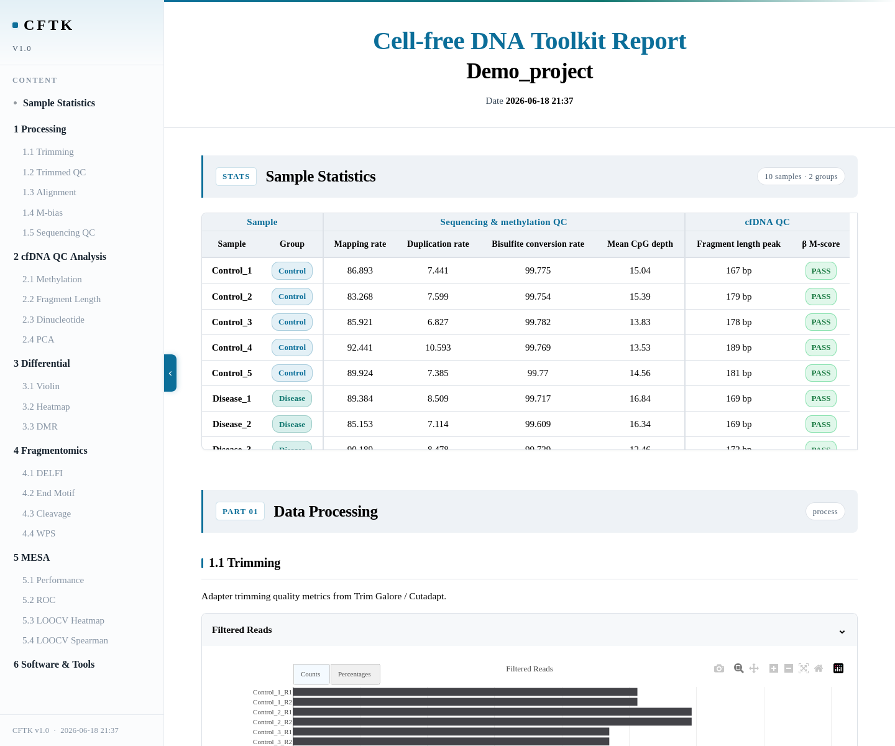

Visualization And Reports
=========================

Visualization Generation
--------------------------
In the standard CFTK workflow, visualizations are generated from existing
result files. Use ``vis`` to regenerate them without rerunning upstream
processing:

.. code-block:: bash

   cftk --config cftk_init.json vis --mode all
   cftk --config cftk_init.json vis --mode power qc diff

Report Generation
-----------------

Generate a HTML report:

.. code-block:: bash

   cftk --config cftk_init.json report

Reports are written under:

.. code-block:: text

   <output_dir>/results/report/

Expected Outputs
----------------

``vis`` refreshes PNG/PDF files in the process, QC, differential,
fragmentomics, and MESA result directories. ``report`` writes a self-contained
HTML file:

.. code-block:: text

   results/report/report.html

The preview below is a static render of the tracked public ``sample_report.html``
demonstration. It contains demo labels and values only; it is not an observed
patient report or a result from the validation cohort. A real report should be
archived with the config, lock, command ledger, run manifest, and source result
tables that produced it.

   Static public demonstration report preview. Interactive charts remain
   interactive in ``report.html``; this PNG is included so the documentation
   has a visible report output without requiring a browser.
