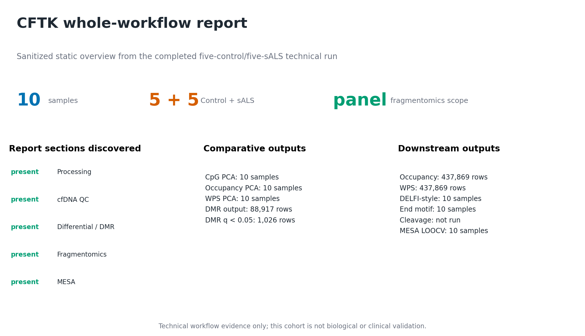

Visualization And Reports
=========================

Visualization Generation
--------------------------
In the standard CFTK workflow, visualizations are generated from existing
result files. Use ``vis`` to regenerate them without rerunning upstream
processing:

.. code-block:: bash

   cftk --config cftk_init.json vis --mode all
   cftk --config cftk_init.json vis --mode power qc diff

Report Generation
-----------------

Generate a HTML report:

.. code-block:: bash

   cftk --config cftk_init.json report

Reports are written under:

.. code-block:: text

   <output_dir>/results/report/

Expected Outputs
----------------

``vis`` refreshes PNG/PDF files in the process, QC, differential,
fragmentomics, and MESA result directories. ``report`` writes a self-contained
HTML file:

.. code-block:: text

   results/report/report.html

``report`` automatically discovers the standard CFTK result directories; do
not supply individual figure or metric paths. Its Workflow Summary aggregates
the newest trusted status for each core-processing/QC and downstream stage from
the provenance manifests, then checks the current required files. The report
embeds available processing/QC, differential/DMR, occupancy, WPS, DELFI,
end-motif, and MESA tables and figures. Running this command rebuilds only the
HTML report and its embedded chart data; it does not rerun a completed analysis
stage.

For a downstream-only project whose sample sheet points to marked BAMs from
earlier CFTK projects, the report also reads the upstream processing and QC
artifacts from those canonical ``results/1_process/3_markdup`` source roots
automatically. The current project results take precedence, and source files
are never copied or modified. This makes FastQC/MultiQC, alignment,
deduplication, M-bias, QC-score, methylation-distribution, and fragment-length
panels available without adding private file paths to the report command.

Every panel reflects an output that was actually found. For example, if the
dinucleotide QC stage was not run, the report displays an explicit
``Dinucleotide QC was not produced`` notice and the command needed to generate
it; it does not substitute a synthetic or partial plot.

The preview below is a sanitized static overview derived from the completed
five-control/five-sALS technical report. It displays the discovered report
sections and aggregate artifact counts without embedding patient identifiers,
source paths, or the private HTML. The underlying ``report.html`` remains the
authoritative interactive report and should be archived with the config, lock,
command ledger, run manifest, and source result tables that produced it. This
technical example is not biological or clinical validation; targeted
fragmentomics panels are explicitly panel-overlap summaries, and cleavage was
not run in this example. The public repository still contains a separate
legacy ``sample_report.html`` demonstration; it is labeled as demo content and
is not this validation result.

   Sanitized static overview of the observed ten-sample technical report.
   Interactive charts remain interactive in ``report.html``; this PNG is a
   public-safe visual index of the sections and outputs found in that report.
   The aggregate evidence metadata is available as
   :download:`JSON <../_static/validation_10sample_downstream_summary.json>`.
